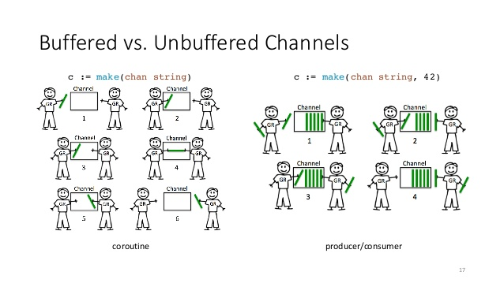

:title: Go Concurrency
:css: slides.css
:script: jasdfasfd.jsq

This is a tutorial for GO Concurrency!

----

:id: first_slide

*Go Concurrency* **Channels!**
====================================

----

:data-x: r2000

What are channels
=================
- Functionally they are native thread-safe fifo queue.
- Channel is a primitive type like int, string, etc.
- Buffered and unbuffered channels
- Highly encouraged by go.

----

Syntax
======

Creating a channel

.. code-block:: go

  // var <variable-name> chan <type>
  var structChan chan struct{Foo int} // default value is nil
  // panic: close of nil channel
  close(structChan)

  // make(chan <type> [, buffer])
  stringChan := make(chan string)
  stringChan = make(chan string, 10)
  close(stringChan)

Accessing channel values

.. code-block:: go

  // writing to channel
  stringChan <- "test"

  // reading from channel
  value := <- stringChan

  // iterating over channel values
  for value, ok := <-stringChan; ok; {
    // work with value
  }

  for value := range stringChan {
    // work with value
  }

----

:data-x: r-100
:data-y: r-150
:data-z: r-600

----

:data-x: r0
:data-y: r350
:data-z: r0

----

:data-x: r100
:data-y: r-200
:data-z: r600

----

:data-x: r2000
:data-y: 0
:data-z: 0

:id: things_to_remember

Things to remember
==================
- Writing to a full (zero buffer) channel is blocking.

  - reading from an empty channel is blocking as well.

- Channels are bi-directional by default.
- Channels can be forced to a single direction by adding ``<-``.

  - ``<-chan`` is recieveonly and ``chan<-`` is sendonly.

- Closed channels give a zero value when read from.
- Closed Channels panic when written to.

----

:id: word_count_initial

Simple word-count example
=========================

.. code-block:: go

  var wordCountMap = map[string]int{}

  func main() {
    re := regexp.MustCompile(`[^A-z]`)
    for _, line := range strings.Split(text, "\n") {
      for _, word := range strings.Split(line, " ") {
        word = re.ReplaceAllString(word, "")
        wordCountMap[word] = wordCountMap[word] + 1
      }
    }

    fmt.Println(wordCountMap)
  }

----

:data-rotate-x: -90
:data-x: r0
:data-y: r0
:data-z: r-1000

First attempt
==============

.. code-block:: go

  func wordGenerator(lineChannel chan string, wordChannel chan string) {
    re := regexp.MustCompile(`[^A-z]`)
    for line := range lineChannel {
      for _, word := range strings.Split(line, " ") {
        wordChannel <- re.ReplaceAllString(word, "")
      }
    }
  }

  func wordCounter(wordChannel chan string) {
    for word := range wordChannel {
      wordCountMap[word] = wordCountMap[word] + 1
    }
  }

  var wordCountMap = map[string]int{}
  func main() {
    lineChannel, wordChannel := make(chan string, 10), make(chan string, 10)
    workerCount := 3

    for i := 0; i < workerCount; i++ {
      go wordGenerator(lineChannel, wordChannel)
      go wordCounter(wordChannel)
    }

    for _, line := range strings.Split(text, "\n") {
      lineChannel <- line
    }

    close(lineChannel)
    close(wordChannel)
    fmt.Println(wordCountMap)
  }

----

:data-x: r-20
:data-y: r-500
:data-z: r-200

----

:data-x: r0
:data-y: r0
:data-z: r350

----

:data-x: r20
:data-y: r500
:data-z: r-150

.. note::

  - Output :: empty map
  - Main go routine exits too early

----

:data-x: r0
:data-y: r0
:data-z: r-1000

Second attempt
==============

.. code-block:: go

  func wordGenerator(lineChannel chan string, wordChannel chan string) {
    defer wg.Done()
    // same as previous
  }

  func wordCounter(wordChannel chan string) {
    defer wg.Done()
    for word := range wordChannel {
      wordCountMap[word] = wordCountMap[word] + 1
    }
  }

  var wordCountMap = map[string]int{}
  var wg = sync.WaitGroup{}

  func main() {
    lineChannel, wordChannel := make(chan string, 10), make(chan string, 10)
    workerCount := 3
    wg.Add(2 * workerCount)

    // same as previous

    close(lineChannel)
    wg.Wait()
    close(wordChannel)

    fmt.Println(wordCountMap)
  }

----

:data-x: r-20
:data-y: r-500
:data-z: r-200

----

:data-x: r-30
:data-y: r-50
:data-z: r300

----

:data-x: r50
:data-y: r550
:data-z: r-100

.. note::

  - Output :: Concurrent memory access error.
  - the map is being read by multiple go routine parallely.
  - Go has memory access syncronization.
  - Go Primitive types will not have this issue.

----

:data-x: r0
:data-y: r0
:data-z: r-1000

Third attempt
==============

.. code-block:: go

  // func wordGenerator

  func wordCounter(wordChannel chan string) {
    defer wg.Done()
    for word := range wordChannel {
      mutex.Lock()
      wordCountMap[word] = wordCountMap[word] + 1
      mutex.Unlock()
    }
  }

  var wordCountMap = map[string]int{}
  var wg = sync.WaitGroup{}
  var mutex = sync.Mutex{}

  func main() {
    lineChannel, wordChannel := make(chan string, 10), make(chan string, 10)
    workerCount := 3
    wg.Add(2 * workerCount)

    // same as previous

    close(lineChannel)
    wg.Wait()
    close(wordChannel)

    fmt.Println(wordCountMap)
  }

----

:data-x: r-150
:data-y: r-600
:data-z: r100

----

:data-x: r150
:data-y: r600
:data-z: r-100

.. note::

  - Output :: all threads are sleep. Deadlock
  - wordCounter never stops because the channel is never closed.
  - the wg.Wait() never resolves because of wordCounter not executing the wg.Done()

----

:data-x: r0
:data-y: r0
:data-z: r-1000

Fourth attempt
==============

.. code-block:: go

  // func wordGenerator

  func wordCounter(wordChannel chan string) {
    defer owg.Done()
    // same as previous
  }

  var wordCountMap = map[string]int{}
  var wg, owg = sync.WaitGroup{}, sync.WaitGroup{}
  var mutex = sync.RWMutex{}

  func main() {
    lineChannel, wordChannel := make(chan string, 10), make(chan string, 10)
    workerCount := 3
    wg.Add(workerCount)
    owg.Add(workerCount)

    // same as previous

    close(lineChannel)
    wg.Wait()
    close(wordChannel)
    owg.Wait()
    fmt.Println(wordCountMap)
  }

----

:data-x: r-20
:data-y: r-450
:data-z: r-70

----

:data-x: r20
:data-y: r450
:data-z: r70

.. note::

  - Finally works

----

:data-rotate-x: 0
:data-x: word_count_initial+0
:data-y: 0
:data-z: 0

----

:data-x: r2000
:data-y: 0
:data-z: 0
:class: perfect

Perfect Code!!!
===============

.. code-block:: go

  func wordGenerator(lineChannel chan string, wordChannel chan string) {
    defer wg.Done()
    re := regexp.MustCompile(`[^A-z]`)
    for line := range lineChannel {
      for _, word := range strings.Split(line, " ") {
        wordChannel <- re.ReplaceAllString(word, "")
      }
    }
  }

  func wordCounter(wordChannel chan string) {
    defer owg.Done()
    for word := range wordChannel {
      mutex.Lock()
      wordCountMap[word] = wordCountMap[word] + 1
      mutex.Unlock()
    }
  }

  var wordCountMap = map[string]int{}
  var wg, owg = sync.WaitGroup{}, sync.WaitGroup{}
  var mutex = sync.RWMutex{}

  func main() {
    lineChannel, wordChannel := make(chan string, 10), make(chan string, 10)
    workerCount := 3
    wg.Add(workerCount)
    owg.Add(workerCount)
    for i := 0; i < workerCount; i++ {
      go wordGenerator(lineChannel, wordChannel)
      go wordCounter(wordChannel)
    }

    for _, line := range strings.Split(text, "\n") {
      lineChannel <- line
    }

    close(lineChannel)
    wg.Wait()
    close(wordChannel)
    owg.Wait()

    fmt.Println(wordCountMap)
  }

----

:data-x: r2000
:data-y: 0
:data-z: 0

Some suggestions
================
- Have a strong reasoning to use channels.
- Channels should always be buffered.

  - Buffer value should be a multiple of readers / writers on the channel.

- Always start the workers first, before ingesting into channel.
- Channels should always be passed as either be recieveonly or sendonly.

  - Recieveonly channels panic when closed.

- If possible do not mix memory access patterns and CSP patterns

----

:class: perfect

Slightly better ?
=================

.. code-block:: go

  func wordGenerator(lineChannel <-chan string, wordChannel chan<- string) {
    defer wg.Done()
    re := regexp.MustCompile(`[^A-z]`)
    for line := range lineChannel {
      for _, word := range strings.Split(line, " ") {
        wordChannel <- re.ReplaceAllString(word, "")
      }
    }
  }

  func wordCounter(wordChannel <-chan string) {
    defer owg.Done()
    for word := range wordChannel {
      wordCountMap[word] = wordCountMap[word] + 1
    }
  }

  var wordCountMap = map[string]int{}
  var wg, owg = sync.WaitGroup{}, sync.WaitGroup{}

  func main() {
    workerCount := 3
    lineChannel, wordChannel := make(chan string, workerCount), make(chan string, workerCount)
    wg.Add(workerCount)
    for i := 0; i < workerCount; i++ {
      go wordGenerator(lineChannel, wordChannel)
    }

    owg.Add(1)
    go wordCounter(wordChannel)

    for _, line := range strings.Split(text, "\n") {
      lineChannel <- line
    }

    close(lineChannel)
    wg.Wait()
    close(wordChannel)
    owg.Wait()

    fmt.Println(wordCountMap)
  }

----

:data-x: r-60
:data-y: r170
:data-z: r-550

.. note::

  - Changed the buffer value to workerCount.
  - Changed wordCounter to run only 1 goroutine to remove the memory access patterns.

----

:data-x: r0
:data-y: r-270
:data-z: r0

.. note::

  - Updated the func channel parameters to directional channels.

----

:data-x: r60
:data-y: r100
:data-z: r550

----

:data-x: r2000
:data-y: 0
:data-z: 0

Select Channels
===============
- When you need to recieve data from multiple channels you can use ``select``

.. code-block:: go

  select {
    case c <- channel1:
      // some stuff with c
    case d <-channel2:
      // some stuff with d
    }
  }

- Randomly chooses if data is ready on multiple channels

----

:data-x: r2000
:data-y: r0
:data-z: r0

:class: super-perfect

**Super-Duper Perfect!!**
=========================

.. code-block:: go

  func wordGenerator(lineChannel <-chan string, wordChannel chan<- string, done <-chan bool) {
    defer wg.Done()
    re := regexp.MustCompile(`[^A-z]`)
    for {
      select {
      case line, ok := <-lineChannel:
        if !ok {
          return
        }
        for _, word := range strings.Split(line, " ") {
          wordChannel <- re.ReplaceAllString(word, "")
        }
      case <-done:
        fmt.Println("wordGenerator quiting")
        return
      }
    }
  }

  func wordCounter(wordChannel <-chan string, done <-chan bool) {
    defer owg.Done()
    for {
      select {
      case word, ok := <-wordChannel:
        if !ok {
          return
        }
        time.Sleep(10 * time.Millisecond)
        wordCountMap[word] = wordCountMap[word] + 1
      case <-done:
        fmt.Println("wordCounter quiting")
        return
      }
    }
  }

  func monitorInterrupt(done chan<- bool) {
    sigs := make(chan os.Signal, 1)
    signal.Notify(sigs, syscall.SIGINT, syscall.SIGTERM)

    <-sigs
    fmt.Println("System interrupt quiting")
    close(done)
  }

  var wordCountMap = map[string]int{}
  var wg, owg = sync.WaitGroup{}, sync.WaitGroup{}

  func main() {
    workerCount := 3
    lineChannel, wordChannel := make(chan string, workerCount), make(chan string, workerCount*1000)
    done := make(chan bool)

    go monitorInterrupt(done)
    wg.Add(workerCount)
    for i := 0; i < workerCount; i++ {
      go wordGenerator(lineChannel, wordChannel, done)
    }

    owg.Add(1)
    go wordCounter(wordChannel, done)

    for _, line := range strings.Split(text, "\n") {
      lineChannel <- line
    }

    fmt.Println("loaded lines")

    close(lineChannel)
    wg.Wait()

    fmt.Println("populated words")

    close(wordChannel)
    owg.Wait()

    fmt.Println(wordCountMap)
  }

----

:data-x: r-200
:data-y: r200
:data-z: r-700

----

:data-x: r0
:data-y: r-100
:data-z: r0

----

:data-x: r0
:data-y: r-250
:data-z: r0

----

:data-x: r0
:data-y: r150
:data-z: r0

----

:data-x: r200
:data-y: r0
:data-z: r700

----

:id: last_slide

:data-x: r2000
:data-y: r0
:data-z: r0

Complicated? May be not
=======================

  - There are cleaner ways to implement the map-reduce problem in go.
  - Code is implemented this way to show frequent complications with channels.
  - This is likely unfair for showing the usefulness of channels in go.
  - Implementing the same solution, with similar functionality in any other popular languages is more cumbersome.

----

:data-rotate-x: 0
:data-x: 10000
:data-y: 5000
:data-z: 15000

**GO Channels GO!**
====================

*Questions?*
------------

Goroutines or Sync package?
###########################
