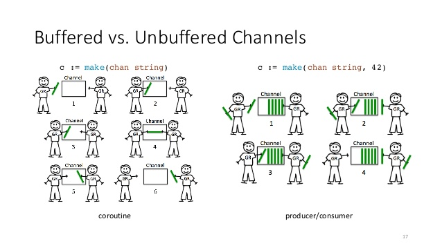

# Go Concurrency
### Part 1: Go-routines and channels

---

# Concurrency Buzz words
- Concurrency vs parallelism
- Atomicity
- Dead locks
- Live locks
- Starvation
- Memory Access Synchronization
- CSP / Process Calculus

---
# Go Philosophy and Primitives
_Do not communicate by sharing memory but share memory by communicating_
- Go-routines
  - Go-routines vs Threads vs Asynchronous calls
- Channels (from CSP)
  - Similar to a fifo queue
- Mutex (from Memory access patterns)
  - Traditional thread safe pattern implemented by most high level languages

---
<!-- _class: code invert -->
# Go-routines
- Any func running “concurrently” to other code
- Syntax - `go <func>` or `go func() {<code>}()`
- Go-routine and Go runtime (M:N scheduler)
- GOMAXPROCS = < No of CPU cores >
- No memory sharing
```go
func main() {
  greeting := “hello world”
  go func() {
    fmt.Println(greeting)
  }()
}
```

---
# Go channels
- Similar to fifo only queue accessed by go-routines
- Writing when full / reading when empty are blocking
- Panics when closing a closed channel.
- Reading form a closed channel will give you a zero value


---
<!-- _class: code invert -->
# Example 1
```go {.line-numbers highlight=10-20}
func worker(readChan <-chan string, writeChan chan<- string) {
  // for value, ok <- readChan; ok {
  for value := range readChan {
    // some work
    writeChan <- "output"
  }
  sync.Once(func() {close(writeChan)}())
}

func master(inputs ...string) {
  workers := 10
  readChan, writeChan := make(chan string, workers), make(chan string, workers)
  for i := 0; i <= workers; i++ {
    go worker(readChan, writeChan)
  }
  for _, input := range inputs {
    readChan <- input
  }
  close(readChan)
  for output := range writeChan {
    // some work
  }
}
```

---
<!-- _class: codes invert -->
# Example 2 with context
```go
func worker(readChan <-chan string, writeChan chan<- string, done <-chan struct{}) {
  defer func() {
    sync.Once(func() {close(writeChan)}())
  }()

  for {
    select {
      case <- done:
        // cancel what ever its doing and return
        return
      case value, ok <- readChan:
        if !ok {
          // channel closed
          return
        }
        // some work
    }
  }
}

func master(inputs ...string) {
  // similar to example 1
  ctx, cancelFunc := context.WithCancel(context.Background())
  // similar to example 1
  go worker(readChan, writeChan, ctx.Done())
  // similar to example 1
}
```
